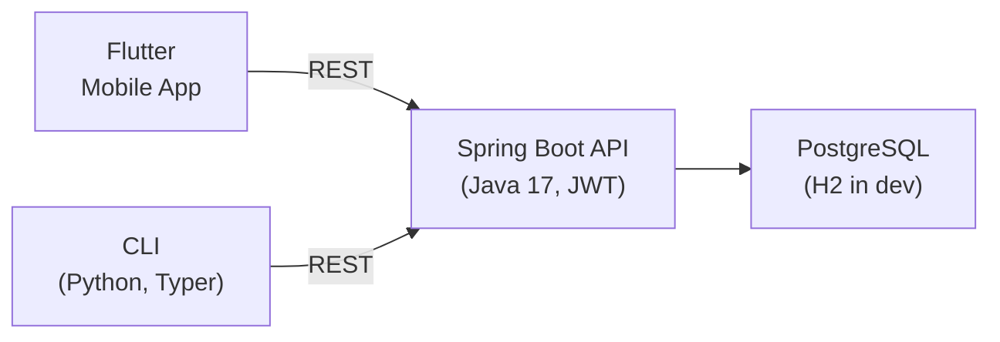

# Trako - Expense Manager

A full-stack expense management app: Flutter mobile UI, Spring Boot API, and a CLI for power users.

## What It Does

- Track expenses and income across multiple accounts and currencies
- Zero-based budgeting with real-time usage tracking
- Transfer money between accounts with split tracking
- JWT authentication (username/password & phone)
- CLI tools for power users and automation

## Architecture



| Component | Path | Tech |
|-----------|------|------|
| Mobile App | `frontend/` | Flutter/Dart |
| REST API | `backend/` | Spring Boot, Liquibase, JWT |
| CLI | `cli/` | Python, Typer, Rich |

## Install the CLI

Download the latest binary from [GitHub Releases](https://github.com/SouravDas25/Tracko/releases/latest) — no Python needed.

**Linux / macOS (one-liner):**
```bash
curl -fsSL https://raw.githubusercontent.com/SouravDas25/Tracko/main/scripts/install.sh | bash
```

This auto-detects your OS and architecture, downloads the right binary, and installs it to `/usr/local/bin`. Run the same command again to update.

**Windows (PowerShell):**
```powershell
irm https://raw.githubusercontent.com/SouravDas25/Tracko/main/scripts/install.ps1 | iex
```

## Quick Start

```bash
trako auth login                        # Login
trako account list                      # List accounts
trako transaction add --amount 50 \
  --type expense --name "Lunch"         # Add expense
trako budget view                       # View budget
trako db seed                           # Seed sample data
```

Common command groups: `account` • `transaction` • `budget` • `category` • `contact` • `currency` • `split` • `stats`

All commands support `--raw` for JSON output and `--help` for usage details.

> Full command reference → **[CLI Guide](cli/README.md)**

## Development

**Prerequisites:** Flutter 3.0+ • Java 17+ • Maven 3.8+ • Python 3.10+

```bash
# Install Task runner (recommended)
go install github.com/go-task/task/v3/cmd/task@latest

task start    # Starts backend (localhost:8080) + Flutter app
task stop     # Stops all services
task test     # Runs test suite
```

> For manual startup, Docker, or Windows scripts → **[Startup Guide](README-STARTUP.md)**

```bash
task start       # Start everything
task backend     # Backend only
task flutter     # Flutter only
task clean       # Clean build artifacts
task install     # Install dependencies
```

Backend API runs at `http://localhost:8080`. Uses H2 in-memory database in development, PostgreSQL in production.

## Documentation

| Guide | Description |
|-------|-------------|
| **[Startup Guide](README-STARTUP.md)** | Configuration, env variables, troubleshooting |
| **[CLI Guide](cli/README.md)** | Full CLI command reference |
| **[CSV Import](money-manager-converter/README.md)** | Migrate data from Money Manager etc. |
